  <h1 class="font-medium">Is your software just built,  or is it engineered ?</h1>
  
In a world of fast features, the most valuable asset is engineered robustness.

---

layout: two-cols
background: /backgrounds/blueprint-texture.png

---

<template v-slot:default>

# From Physical Systems to Digital Architecture.

## Modern Architecture

<ArchitectureDiagram class="mt-8" />

</template>

<template v-slot:right>

## Introduction

**Timothy DeHof**: A Full-Stack Engineer with a B.S. in Mechanical Engineering. This isn't a career change; it's the fusion of two disciplines dedicated to one goal: building systems that are reliable, scalable, and maintainable for the long term.

### Key Focus

Building systems with engineering precision applied to software development.

</template>

---

layout: default
background: /backgrounds/grid-technical.png

---

# An Engineer's Mindset for Software Integrity

If software is a machine, an engineer understands its core principles:

### Physical Engineering

  ⚙️
  

    <strong>Bill of Materials</strong> → Dependency Management & Supply Chain Security
  

  📏
  

    <strong>Tolerances</strong> → Error Handling & Graceful Degradation
  

  🔍
  

    <strong>Failure Analysis</strong> → Rigorous Debugging & Systemic QA
  

  🔧
  

    <strong>Maintenance Cycles</strong> → Long-Term Code Maintainability
  

  <ArchitectureDiagram />

---

layout: two-cols
background: /backgrounds/grid-technical.png

---

<template v-slot:default>

# Forged in High-Stakes Environments.

### Professional Background

**7+ years** as a Mechanical Design Engineer at Polyhistor International, serving highly regulated industries.

  

    
🏥

    
Medical

  

  

    
🛡️

    
Defense

  

  

    
🖨️

    
3D Printing

  

  

    
✅

    
QA

  

</template>

<template v-slot:right>

### Key Achievements

- Led over **30 3D printing projects** for **Medical and Defense** clients.

- Expertise in rigorous QA, defect detection, and uncompromising adherence to specifications.

- Automated internal quoting tools with Python & SQL, reducing time by **50%**.

</template>

---

layout: center
class: text-center
background: /backgrounds/grid-technical.png

---

# The Engineering Discipline Applied to Code

<StatCard
  percentage="25%"
  icon="i-mdi-cube-outline"
  description="Accelerated front-end development cycle through modular architecture."
  color="#2563eb"
/>

<StatCard
  percentage="99.9%"
  icon="i-mdi-shield-check"
  description="Maintained service reliability for a scalable SaaS platform."
  color="#16a34a"
/>

<StatCard
  percentage="30%"
  icon="i-mdi-rocket-launch"
  description="Faster production deployments via CI/CD pipeline optimization."
  color="#f59e0b"
/>

---

layout: two-cols
background: /backgrounds/grid-technical.png

---

<template v-slot:default>

# Architecting an Enterprise-Ready SaaS Frontend

## Architecture Pattern

```mermaid
graph TD
    A[Modular Component Library<br/>TypeScript] --> B[Tenant App A]
    A --> C[Tenant App B]
    A --> D[Tenant App C<br/>✓ WCAG 2.1]

    style A fill:#dbeafe,stroke:#2563eb
    style B fill:#f0f9ff,stroke:#0284c7
    style C fill:#f0f9ff,stroke:#0284c7
    style D fill:#dcfce7,stroke:#16a34a
```

</template>

<template v-slot:right>

## Key Achievements

**Modular Component Library**: Architected and deployed in TypeScript, establishing a single source of truth.

**Scalable Multi-Tenant Design**: Ensured code was reusable, maintainable, and could serve multiple customers securely.

**Accessibility by Design**: Ensured full **WCAG 2.1 accessibility compliance** in customer dashboards, a non-negotiable for enterprise readiness.

Mentored team on Test-Driven Development (TDD), improving code quality metrics by **20%**.

</template>

---

layout: center
class: text-center
background: /backgrounds/grid-technical.png

---

# Validated by the Development Community

## Open Source: Shadcn Timeline Component Library

  
270+

  
⭐ GitHub Stars

  
13

  
🔱 Forks

✅ **Type-Safe & Composable**: Engineered with TypeScript for reliability.

✅ **90% Test Coverage**: Built with Jest and Storybook, ensuring component robustness.

---

layout: two-cols
background: /backgrounds/blueprint-texture.png

---

<template v-slot:default>

# Bridging Mechanical Visualization and Digital Interaction

## 3D Product Configurator

**Real-time Rendering**: Built with Next.js and React Three Fiber.

**Performance Optimized**: Achieved a stable **60 FPS** average frame rate and reduced initial load times through efficient asset management.

**Modular Architecture**: Designed to bridge physical design principles with modern component-based UI.

  
⚡ 60 FPS

  
Consistent Performance

</template>

<template v-slot:right>

  

    
🎮

    
Interactive 3D

    
Product Configurator

  

</template>

---

layout: default
background: /backgrounds/grid-technical.png

---

# The Engineer's Toolkit

<TechStack
  title="Frontend & Architecture"
  :items="[
    { name: 'React', icon: '⚛️' },
    { name: 'TypeScript', icon: '📘' },
    { name: 'Next.js', icon: '⚡' },
    { name: 'Tailwind CSS', icon: '🎨' },
    { name: 'Component-Based Architecture', icon: '🧩' }
  ]"
  color="#2563eb"
/>

<TechStack
  title="Cloud & DevOps"
  :items="[
    { name: 'AWS Certified Cloud Practitioner', icon: '☁️' },
    { name: 'GitHub Actions (CI/CD)', icon: '🔄' },
    { name: 'Docker', icon: '🐳' },
    { name: 'Serverless', icon: '⚡' }
  ]"
  color="#f59e0b"
/>

<TechStack
  title="Backend & Databases"
  :items="[
    { name: 'Node.js', icon: '🟢' },
    { name: 'Express.js', icon: '🚂' },
    { name: 'PostgreSQL (PERN Stack)', icon: '🐘' },
    { name: 'REST/GraphQL APIs', icon: '🔌' },
    { name: 'Prisma', icon: '🔺' }
  ]"
  color="#16a34a"
/>

<TechStack
  title="Testing & QA"
  :items="[
    { name: 'Jest', icon: '🃏' },
    { name: 'Cypress', icon: '🌲' },
    { name: 'Playwright', icon: '🎭' },
    { name: 'Test-Driven Development (TDD)', icon: '✅' },
    { name: 'WCAG 2.1 Compliance', icon: '♿' }
  ]"
  color="#dc2626"
/>

---

layout: center
class: text-center
background: /backgrounds/grid-technical.png

---

# Applications in High-Stakes Environments

<IndustryCard
  title="SaaS"
  icon="i-mdi-cloud-cog"
  description="Scalable multi-tenant architecture and 99.9% reliability."
  color="#2563eb"
/>

<IndustryCard
  title="HealthTech & Defense"
  icon="i-mdi-shield-plus"
  description="A deep-rooted understanding of compliance, security, and rigorous QA from direct industry experience."
  color="#dc2626"
/>

<IndustryCard
  title="FinTech"
  icon="i-mdi-bank"
  description="Focus on data integrity with PostgreSQL and a mindset geared towards transactional robustness."
  color="#f59e0b"
/>

<IndustryCard
  title="Industrial IoT"
  icon="i-mdi-cog-sync"
  description="Unique ability to bridge physical systems and digital infrastructure."
  color="#16a34a"
/>

---

layout: default
background: /backgrounds/grid-technical.png

---

# Moving from Reactive Fixes to Proactive Design

<ComparisonSlide
  leftTitle="What Is: The Cost of Unengineered Code"
  rightTitle="What Could Be: The Value of Engineered Systems"
  :leftItems="[
    'Brittle features that break under load',
    'Escalating technical debt',
    'Slow, risky deployments'
  ]"
  :rightItems="[
    'Robust, scalable architecture',
    'Long-term maintainability',
    'Accelerated, reliable development cycles'
  ]"
  leftColor="#dc2626"
  rightColor="#16a34a"
/>

---

layout: cover
background: /backgrounds/bridge-sunset.png
class: text-center

---

# Let's build software that's not just functional for today, but engineered for the decade ahead.

---

layout: center
class: text-center
background: /backgrounds/grid-technical.png

---

# Architect the Solution.

  
Timothy DeHof

  
Full-Stack Engineer

  

    📧 ttdehof@gmail.com
  

  

    📱 (904) 704-1790
  

  

    🔗 <a href="https://linkedin.com/in/tim-dehof" class="text-blue-600 hover:underline">linkedin.com/in/tim-dehof</a>
  

  

    💻 <a href="https://github.com/timDeHof" class="text-blue-600 hover:underline">github.com/timDeHof</a>
  

  <a href="#" class="inline-block px-12 py-4 bg-blue-600 text-white rounded-lg text-xl font-semibold hover:bg-blue-700 transition-colors shadow-lg">
    Schedule a technical deep-dive
  </a>

